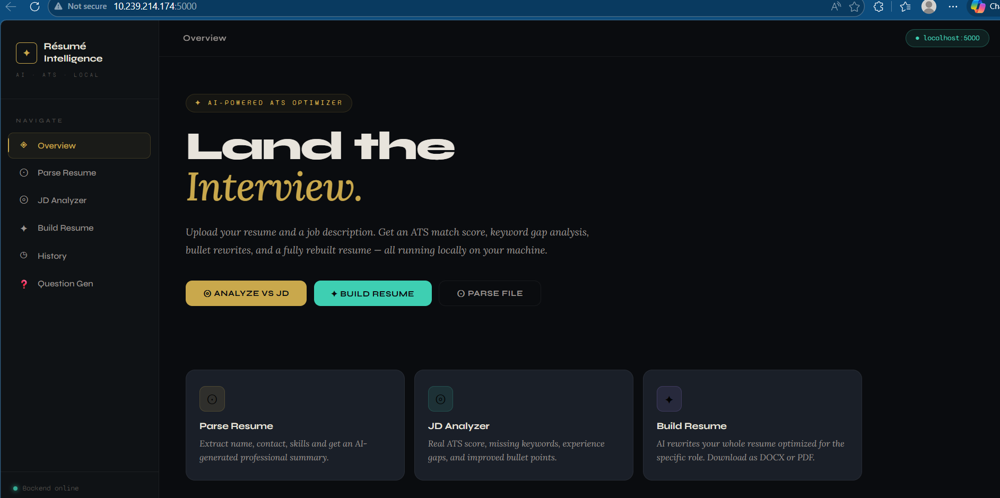

# 🤖 AI Resume Analyzer

<div align="center">


**An AI-powered resume analyzer with a Python backend and a custom HTML/CSS/JS frontend. Upload your resume, match it against a job description, and get intelligent feedback powered by a local LLM via Ollama.**

[Features](#-features) • [Project Structure](#-project-structure) • [Installation](#-installation) • [Usage](#-usage) • [Screenshots](#-screenshots) • [Contributing](#-contributing)

</div>

---

## 📸 Screenshots

| Home Page | Resume Parser | JD Analyzer |
|-----------|--------------|-------------|
|  |  |  |

---

## ✨ Features

- 📄 **Resume Parsing** — Extracts and structures content from uploaded resumes (`parser.py`)
- 🧠 **LLM-Powered Analysis** — Uses a local Ollama LLM to analyze resumes intelligently (`llm_analyzer.py`)
- 🎯 **Job Description Matching** — Compare your resume against any JD for a fit score
- 💡 **Resume Builder Tips** — Suggests improvements based on the analysis (`Resume_builder.py`)
- 🗂️ **History Tracking** — Saves past analyses as JSON files in the `history/` folder
- 📁 **File Uploads** — Handles resume uploads via the `uploads/` directory
- 🌐 **Custom Web UI** — Clean frontend built with HTML, CSS, and JavaScript (`templates/index.html`)
- 🔒 **Privacy-First** — Runs fully locally using Ollama — no data sent to external APIs

---

## 🛠️ Tech Stack

| Layer | Technology |
|-------|-----------|
| Backend | Python 3.8+ |
| Web Framework | Flask / FastAPI |
| Frontend | HTML5, CSS3, Vanilla JavaScript |
| LLM Integration | Ollama (local LLM) |
| Resume Parsing | `parser.py` (PyPDF2 / pdfminer / python-docx) |
| LLM Client | `ollama_client.py` |
| History Storage | JSON files |

---

## 📁 Project Structure

```
AI-Resume-Analyzer/
│
├── templates/
│   └── index.html          # Main frontend UI (HTML/CSS/JS)
│
├── screenshots/
│   ├── home_page.png
│   ├── JD Analyzer1.png
│   ├── JD Analyzer2.png
│   ├── Parse Resume1.png
│   └── Parse Resume2.png
│
├── history/                # Saved analysis results (JSON)
│   ├── 20260305_172522.json
│   └── 20260305_173139.json
│
├── uploads/                # Uploaded resume files (temp storage)
│
├── app.py                  # Main Flask app — routes & server
├── main.py                 # App entry point
├── llm_analyzer.py         # LLM-based resume analysis logic
├── ollama_client.py        # Ollama API client wrapper
├── parser.py               # Resume text extraction (PDF/DOCX)
├── Resume_builder.py       # Resume improvement suggestions
├── requirements.txt        # Python dependencies
├── .gitignore
└── README.md
```

---

## 🚀 Installation

### Prerequisites

- Python 3.8+
- [Ollama](https://ollama.ai) installed and running locally

### Step 1 — Clone the repository

```bash
git clone https://github.com/shaikinzamam/AI-Resume-Analyzer.git
cd AI-Resume-Analyzer
```

### Step 2 — Create a virtual environment

```bash
python -m venv .venv

# On Windows
.venv\Scripts\activate

# On macOS/Linux
source .venv/bin/activate
```

### Step 3 — Install dependencies

```bash
pip install -r requirements.txt
```

### Step 4 — Set up Ollama

Make sure Ollama is installed and a model is pulled:

```bash
# Install Ollama from https://ollama.ai
# Then pull a model (example):
ollama pull llama3
# or
ollama pull mistral
```

Ensure Ollama is running:

```bash
ollama serve
```

### Step 5 — Run the app

```bash
python main.py
# or
python app.py
```

Open your browser at: **`http://localhost:5000`**

---

## 📖 Usage

1. Open `http://localhost:5000` in your browser
2. **Upload your resume** — PDF or DOCX format
3. **Paste a job description** in the JD input field
4. **Click Analyze** — the backend processes it through the LLM
5. **View your results:**
   - Match score and keyword analysis
   - Skill gaps and missing keywords
   - Resume improvement suggestions
6. **History** — past analyses are saved automatically in the `history/` folder as JSON

---

## ⚙️ Configuration

You can configure the Ollama model inside `ollama_client.py`:

```python
MODEL_NAME = "llama3"   # Change to any model you have pulled
OLLAMA_URL = "http://localhost:11434"
```

---

## 🐛 Known Issues / TODO

- [ ] Add drag-and-drop resume upload
- [ ] Support multiple resume formats (TXT, image-based PDF via OCR)
- [ ] Export analysis report as PDF
- [ ] Add user authentication
- [ ] Dark mode toggle
- [ ] Deploy with Docker

---

## 🤝 Contributing

Contributions are welcome!

1. Fork the repository
2. Create a feature branch: `git checkout -b feature/your-feature`
3. Commit your changes: `git commit -m "Add: your feature"`
4. Push to the branch: `git push origin feature/your-feature`
5. Open a Pull Request

---

## 📄 License

This project is licensed under the MIT License — see the [LICENSE](LICENSE) file for details.

---

## 👤 Author

**Shaik Inzamam**

- GitHub: [@shaikinzamam](https://github.com/shaikinzamam)

---

<div align="center">

⭐ If you found this project helpful, please give it a star!

</div>
